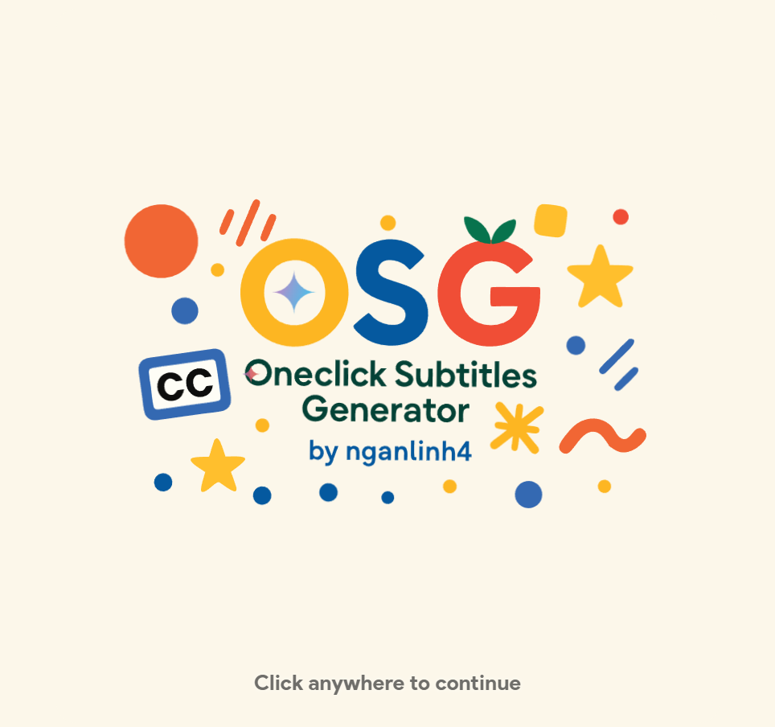
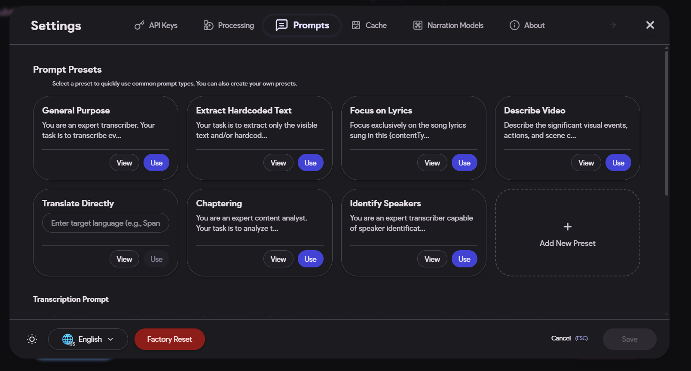
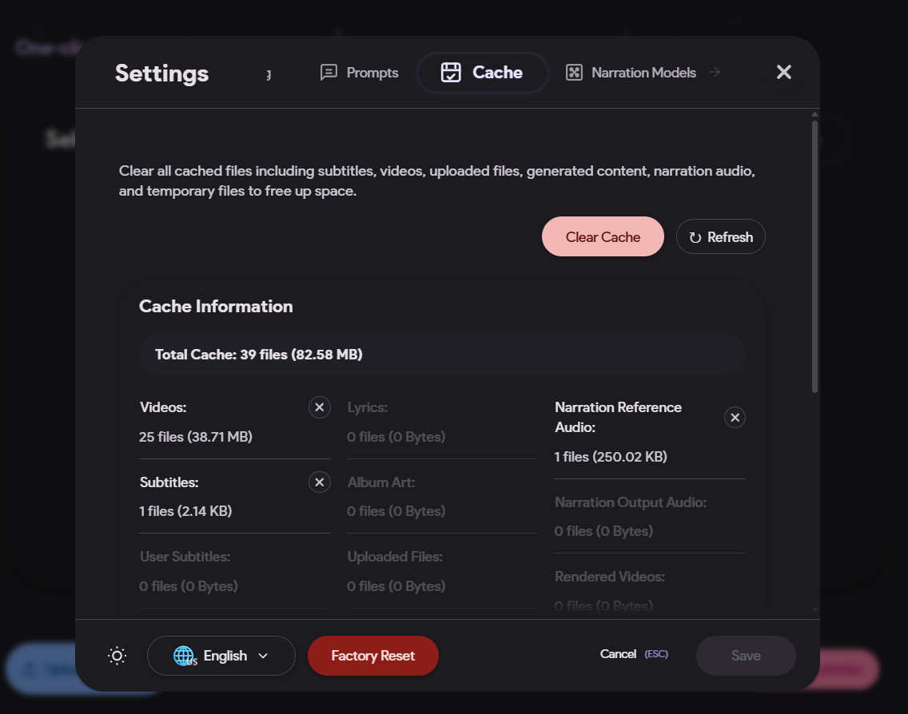
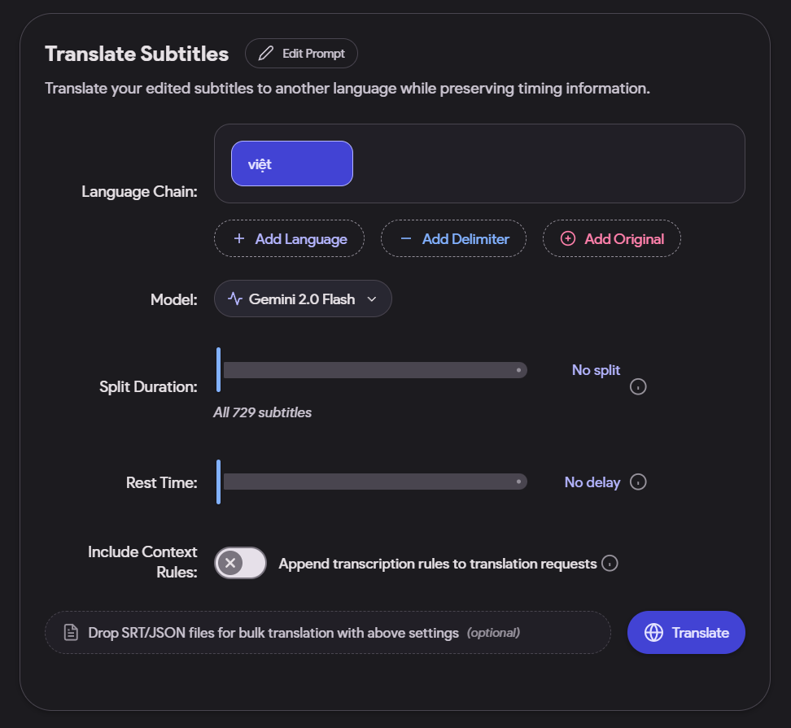
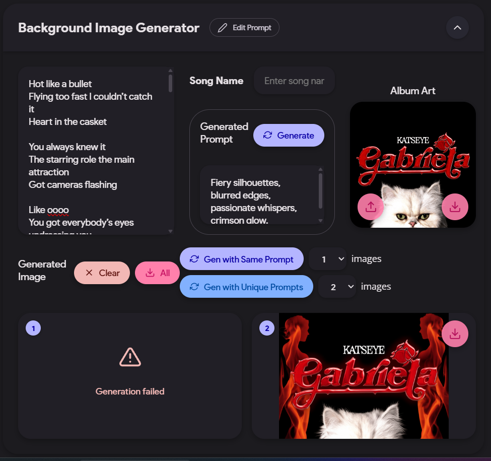
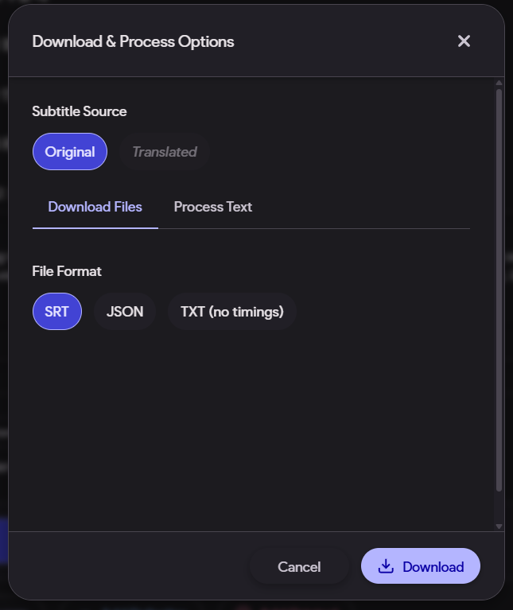

# One-Click Subtitles Generator

Xem bản tiếng Việt [tại đây](README.vi.md).

## Screenshots

<details>
<summary>Click to view screenshots</summary>

Here are some screenshots showcasing the application's current features:

<div align="center">
  <table>
    <tr>
      <td></td>
      <td></td>
      <td></td>
    </tr>
    <tr>
      <td align="center"><strong>Caption later</strong></td>
      <td align="center"><strong>Caption later</strong></td>
      <td align="center"><strong>Caption later</strong></td>
    </tr>
    <tr>
      <td></td>
      <td></td>
      <td></td>
    </tr>
    <tr>
      <td align="center"><strong>Caption later</strong></td>
      <td align="center"><strong>Caption later</strong></td>
      <td align="center"><strong>Caption later</strong></td>
    </tr>
    <tr>
      <td></td>
      <td></td>
      <td></td>
    </tr>
    <tr>
      <td align="center"><strong>Caption later</strong></td>
      <td align="center"><strong>Caption later</strong></td>
      <td align="center"><strong>Caption later</strong></td>
    </tr>
    <tr>
      <td></td>
      <td></td>
      <td></td>
    </tr>
    <tr>
      <td align="center"><strong>Caption later</strong></td>
      <td align="center"><strong>Caption later</strong></td>
      <td align="center"><strong>Caption later</strong></td>
    </tr>
    <tr>
      <td></td>
      <td></td>
      <td></td>
    </tr>
    <tr>
      <td align="center"><strong>Caption later</strong></td>
      <td align="center"><strong>Caption later</strong></td>
      <td align="center"><strong>Caption later</strong></td>
    </tr>
    <tr>
      <td></td>
      <td></td>
      <td></td>
    </tr>
    <tr>
      <td align="center"><strong>Caption later</strong></td>
      <td align="center"><strong>Caption later</strong></td>
      <td align="center"><strong>Caption later</strong></td>
    </tr>
    <tr>
      <td></td>
      <td></td>
      <td></td>
    </tr>
    <tr>
      <td align="center"><strong>Caption later</strong></td>
      <td align="center"><strong>Caption later</strong></td>
      <td align="center"><strong>Caption later</strong></td>
    </tr>
    <tr>
      <td></td>
      <td></td>
      <td></td>
    </tr>
    <tr>
      <td align="center"><strong>Caption later</strong></td>
      <td align="center"><strong>Caption later</strong></td>
      <td align="center"><strong>Caption later</strong></td>
    </tr>
    <tr>
      <td></td>
      <td></td>
      <td></td>
    </tr>
    <tr>
      <td align="center"><strong>Caption later</strong></td>
      <td align="center"><strong>Caption later</strong></td>
      <td align="center"><strong>Caption later</strong></td>
    </tr>
    <tr>
      <td></td>
      <td></td>
      <td></td>
    </tr>
    <tr>
      <td align="center"><strong>Caption later</strong></td>
      <td align="center"><strong>Caption later</strong></td>
      <td align="center"><strong>Caption later</strong></td>
    </tr>
    <tr>
      <td></td>
      <td></td>
      <td></td>
    </tr>
    <tr>
      <td align="center"><strong>Caption later</strong></td>
      <td align="center"><strong>Caption later</strong></td>
      <td align="center"><strong>Caption later</strong></td>
    </tr>
    <tr>
      <td></td>
      <td></td>
      <td></td>
    </tr>
    <tr>
      <td align="center"><strong>Caption later</strong></td>
      <td align="center"><strong>Caption later</strong></td>
      <td align="center"><strong>Caption later</strong></td>
    </tr>
    <tr>
      <td></td>
      <td></td>
      <td></td>
    </tr>
    <tr>
      <td align="center"><strong>Caption later</strong></td>
      <td align="center"><strong>Caption later</strong></td>
      <td></td>
    </tr>
  </table>
</div>

</details>

A comprehensive web application for auto-subtitling videos and audio, translating SRT files, generating AI narration with voice cloning, creating background images and music, and rendering professional subtitled videos. Designed for content creators, educators, and general users who need high-quality subtitle generation and video production capabilities.

## Installation Options Comparison

Choose the right version for your needs:

| Feature | OSG Lite | OSG Full | OSG Vercel |
|---------|----------|------------|------------|
| **AI Subtitle Generation** | ✅ Gemini AI transcription | ✅ Gemini + Parakeet AI transcription | ✅ Gemini AI transcription |
| **Video Sources** | ✅ YouTube, Douyin/TikTok, 1000+ platforms + Upload | ✅ YouTube, Douyin/TikTok, 1000+ platforms + Upload | Upload only |
| **Subtitle Editor** | ✅ Visual timeline, waveform, real-time preview | ✅ Visual timeline, waveform, real-time preview | ✅ Visual timeline, waveform, real-time preview |
| **Translation** | ✅ Multi-language with context awareness | ✅ Multi-language with context awareness | ✅ Multi-language with context awareness |
| **Video Rendering** | ✅ GPU-accelerated with Remotion | ✅ GPU-accelerated with Remotion | ❌ Not available |
| **Background Music Generation** | ✅ AI music with Lyria | ✅ AI music with Lyria | ✅ AI music with Lyria |
| **Basic TTS** | ✅ Gemini Live API, Edge TTS, Google TTS | ✅ Gemini Live API, Edge TTS, Google TTS | ❌ Not available |
| **Voice Cloning** | ❌ Not included | ✅ F5-TTS, Chatterbox | ❌ Not available |
| **Project Folder Size** | ~2-3 GB | ~8-12 GB | N/A (hosted) |
| **GPU Requirements** | Any GPU for video rendering | GPU accelerated voice cloning (CPU fallback available) | None (no rendering) |

### 💡 **Recommendation:**
- **Choose OSG Lite** if you need fast subtitle generation and video rendering without voice cloning
- **Choose OSG (Full)** if you need advanced voice cloning and narration capabilities

## Quick Installation Guide

### Installation on Windows

- Go to [Releases](https://github.com/nganlinh4/oneclick-subtitles-generator/releases) and download the latest OSG_installer_Windows.bat.

- Open the downloaded .bat file and follow the instructions (app size will be large if installing with voice cloning feature)


### Installation on macOS and Ubuntu

- Clone this repo and run the OSG_installer.sh file:
  ```bash
  git clone https://github.com/nganlinh4/oneclick-subtitles-generator.git
  cd oneclick-subtitles-generator
  chmod +x OSG_installer.sh
  ./OSG_installer.sh
  ```

- Follow the on-screen instructions (app size will be large if installing with voice cloning feature)

### Update or Run Application

#### Windows
- Open OSG_installer_Windows.bat and follow the instructions.

#### macOS and Ubuntu
- Open Terminal and run the OSG_installer.sh file again:
  ```bash
  ./OSG_installer.sh
  ```

- Browser will automatically open at http://localhost:3030

## Features

### 🎬 Video & Audio Processing
- **Multi-source support**: Upload video/audio files, YouTube URLs, Douyin/TikTok links, or search YouTube by title
- **Format compatibility**: Supports MP4, AVI, MOV, WebM, WMV, MP3, WAV, AAC, FLAC, and more
- **Quality scanning**: Intelligent video quality detection with cookie-based authentication for premium content
- **Video compatibility checking**: Automatic format conversion for Remotion compatibility

### 🤖 AI-Powered Subtitle Generation
- **Google Gemini AI**: Uses latest Gemini 2.5 models (Flash, Pro) for accurate transcription
- **NVIDIA Parakeet (local, optional)**: On-device ASR for fast, private transcription when running OSG Full. Choose the "NVIDIA Parakeet" method in the subtitle generation dialog. Unified with the same lifecycle, retries, and progress UI as Gemini.
- **Multi-language support**: Generate subtitles in multiple languages with high accuracy
- **Parallel processing**: Handles long videos (15+ minutes) with intelligent segmentation
- **Custom prompts**: Configurable transcription prompts for specialized content
- **Retry mechanisms**: Smart retry with different models for failed segments

### ✏️ Advanced Subtitle Editing
- **Visual timeline editor**: Drag-and-drop timing adjustments with waveform visualization
- **Real-time preview**: Live subtitle synchronization with video playback
- **Sticky timing**: Batch adjust multiple subtitles simultaneously
- **Text editing**: Direct text modification with undo/redo functionality
- **Merge & split**: Combine adjacent subtitles or split long ones
- **Format support**: Export to SRT, JSON, or custom formats

### 🗣️ AI Voice Narration
- **F5-TTS integration**: State-of-the-art voice cloning technology
- **Chatterbox TTS**: High-quality text-to-speech with voice conversion
- **Edge TTS & Google TTS**: Multiple TTS engine options
- **Reference audio**: Upload, record, or extract voice samples from videos
- **Multi-audio tracks**: Combine original audio with AI-generated narration
- **Volume controls**: Independent audio level management

### 🌍 Translation & Localization
- **Multi-language translation**: Translate subtitles to any language while preserving timing
- **Custom formatting**: Configurable output formats with brackets, delimiters, and chains
- **Batch processing**: Translate multiple subtitle sets simultaneously
- **Context awareness**: AI-powered translation with video context understanding

<!-- ### 🎨 Background Image Generation
- **AI-powered creation**: Generate custom backgrounds using Gemini's image generation
- **Album art integration**: Use existing artwork as reference for style consistency
- **Batch generation**: Create multiple variations with unique prompts
- **Smart prompting**: Automatic prompt generation based on lyrics and content
-->

### 🎹 Background Music Generation
- AI-generated background music with prompt-based control
- MIDI playback and control support (promptdj-midi)
- Simple export for use in video rendering


### 🎥 Professional Video Rendering
- **Remotion integration**: GPU-accelerated video rendering with hardware optimization
- **Multi-resolution support**: 360p to 8K output with automatic aspect ratio detection
- **Subtitle customization**: Extensive styling options including fonts, colors, effects, and animations
- **Multi-audio support**: Combine original video audio with AI narration tracks
- **Background integration**: Use generated images or video backgrounds
- **Render queue**: Batch processing with progress tracking


## How to Use

### 1. **Select Your Content Source**
   - **File Upload**: Drag & drop or browse for video/audio files
   - **YouTube**: Paste URL or search by title with thumbnail preview
   - **Douyin/TikTok**: Paste URL for automatic extraction
   - **Other platforms**: Use any supported video URL

### 2. **Generate AI Subtitles**
  - Choose your preferred engine:
    - Gemini (cloud) for convenience and strong accuracy
    - NVIDIA Parakeet (local) for on-device, privacy-friendly transcription (requires OSG Full)
  - Pick your Gemini model (2.5 Flash/Pro recommended) or Parakeet strategy (sentence/word/char)
   - Configure custom prompts for specialized content
   - Click "Generate timed subtitles" and monitor progress
   - Long videos are automatically processed in parallel segments

### 3. **Edit & Refine Subtitles**
   - **Visual timeline**: Drag timing handles with waveform visualization
   - **Real-time preview**: See changes instantly synchronized with video
   - **Text editing**: Click to edit subtitle content directly
   - **Batch operations**: Use sticky timing for multiple subtitle adjustments
   - **Advanced tools**: Merge, split, insert, or delete subtitle segments

### 4. **Translate Content** (Optional)
   - Select target languages for translation
   - Configure output formatting (brackets, delimiters, chains)
   - Use context-aware AI translation with video understanding
   - Preserve original timing while adapting text

### 5. **Generate AI Narration** (Optional)
    - **Set up reference audio**: Upload, record, or extract from video
    - **Choose TTS engine**: F5-TTS (voice cloning), Chatterbox, Edge TTS, or Google TTS
    - **Configure voice settings**: Adjust speed, pitch, and style parameters
    - **Generate narration**: Create AI voice for original or translated subtitles

### 6. **Create Background Music** (Optional)
   - Open the Background Music panel
   - Enter a prompt or choose presets, then generate
   - Preview and adjust via MIDI controls; export for rendering

### 7. **Render Professional Videos**
   - **Open video renderer**: Access the integrated Remotion-based renderer
   - **Customize subtitles**: Extensive styling options (fonts, colors, effects, animations)
   - **Configure audio**: Balance original video audio with AI narration
   - **Set output quality**: Choose resolution from 360p to 8K
   - **Render with GPU acceleration**: Hardware-optimized processing for fast output

### 8. **Export & Download**
   - **Subtitle files**: SRT, JSON, or custom formats
   - **Audio files**: Generated narration in various formats
   - **Rendered videos**: Professional subtitled videos with custom styling


## Configuration

Access settings via the gear icon in the top-right corner:
- **API Keys**: Gemini (required), YouTube (optional for search)
- **AI Models**: Choose between Gemini 2.5 Flash, Pro, or experimental models
- **Processing Method**: Switch between Gemini (cloud) and NVIDIA Parakeet (local ASR, OSG Full)
- **Languages**: English, Vietnamese, Korean interface support
- **Video Processing**: Segment duration, quality preferences, cookie management
- **TTS Engines**: F5-TTS, Chatterbox, Gemini Live API, Edge TTS, or Google TTS selection
- **Interface**: Dark/light themes, time format, waveform visualization
- **Cache Management**: Clear caches and monitor storage usage

## Technical Stack

- **Frontend**: React 18, Styled Components, i18next
- **Video Rendering**: Remotion 4 with GPU acceleration (Vulkan/OpenGL)
- **Backend**: Node.js/Express, Python Flask, FastAPI
- **AI Integration**: Google Gemini API, F5-TTS, Chatterbox TTS
  , NVIDIA Parakeet (local ASR)
- **Audio/Video**: FFmpeg, Web Audio API, yt-dlp, Puppeteer
- **Performance**: React Window virtualization, multi-level caching, hardware acceleration

## Performance Features

- **GPU Acceleration**: Hardware-accelerated video rendering with Vulkan/OpenGL
- **Virtualized UI**: Only renders visible elements for optimal performance with long videos
- **Parallel Processing**: Multi-core subtitle generation and video processing
- **Smart Caching**: Multi-layer cache system for subtitles, videos, and generated content
- **Optimized Timeline**: Hardware-accelerated canvas visualization with adaptive rendering
- **Efficient Memory**: Automatic cleanup and smart resource management

## Acknowledgements

### 🎯 Core Technologies
- **[React](https://reactjs.org/)** - Modern UI framework with hooks and context
- **[Remotion](https://remotion.dev/)** - Programmatic video creation and rendering
- **[Node.js](https://nodejs.org/)** - JavaScript runtime for backend services
- **[Express](https://expressjs.com/)** - Web application framework for Node.js

### 🤖 AI & Machine Learning
- **[Google Gemini AI](https://deepmind.google/technologies/gemini/)** - Advanced language models for transcription and image generation
- **[F5-TTS](https://github.com/SWivid/F5-TTS)** - State-of-the-art voice cloning technology
- **[Chatterbox](https://github.com/resemble-ai/chatterbox)** - High-quality TTS and voice conversion
- **[Microsoft Edge TTS](https://azure.microsoft.com/en-us/services/cognitive-services/text-to-speech/)** - Neural text-to-speech service
- **[Google Text-to-Speech](https://cloud.google.com/text-to-speech)** - Cloud-based speech synthesis
 - NVIDIA Parakeet (local ASR)

### 🎬 Video & Audio Processing
- **[FFmpeg](https://ffmpeg.org/)** - Comprehensive multimedia framework
- **[yt-dlp](https://github.com/yt-dlp/yt-dlp)** - Universal video downloader for 1000+ platforms
- **[Puppeteer](https://pptr.dev/)** - Headless Chrome control for web scraping

### 🎨 UI & Visualization
- **[Styled Components](https://styled-components.com/)** - CSS-in-JS styling solution
- **[React Router](https://reactrouter.com/)** - Declarative routing for React
- **[React Window](https://github.com/bvaughn/react-window)** - Efficient virtualization for large lists
- **[React Icons](https://react-icons.github.io/react-icons/)** - Popular icon libraries for React
- **HTML5 Canvas** - Hardware-accelerated timeline visualization

### 🌐 Internationalization & Accessibility
- **[i18next](https://www.i18next.com/)** - Internationalization framework
- **[React i18next](https://react.i18next.com/)** - React integration for i18next
- **Material 3 Expressive** - Modern design principles and accessibility standards

### 🔧 Development & Build Tools
- **[TypeScript](https://www.typescriptlang.org/)** - Type-safe JavaScript development
- **[Create React App](https://create-react-app.dev/)** - React application scaffolding
- **[Concurrently](https://github.com/open-cli-tools/concurrently)** - Multi-service development environment
- **[Cross-env](https://github.com/kentcdodds/cross-env)** - Cross-platform environment variables

### 📦 Package Management & Deployment
- **[npm](https://www.npmjs.com/)** - Package manager for JavaScript
- **[uv](https://github.com/astral-sh/uv)** - Fast Python package installer and resolver
- **[Python](https://www.python.org/)** - Backend services for AI processing

### 🙏 Special Thanks
- **Open source community** for maintaining these incredible tools
- **Google DeepMind** for advancing AI accessibility
- **Remotion team** for revolutionizing programmatic video creation
- **F5-TTS contributors** for open-source voice cloning technology
- **All beta testers and contributors** who helped improve this application


## License

MIT License

Copyright (c) 2025 Oneclick Subtitles Generator

Permission is hereby granted, free of charge, to any person obtaining a copy
of this software and associated documentation files (the "Software"), to deal
in the Software without restriction, including without limitation the rights
to use, copy, modify, merge, publish, distribute, sublicense, and/or sell
copies of the Software, and to permit persons to whom the Software is
furnished to do so, subject to the following conditions:

The above copyright notice and this permission notice shall be included in all
copies or substantial portions of the Software.

THE SOFTWARE IS PROVIDED "AS IS", WITHOUT WARRANTY OF ANY KIND, EXPRESS OR
IMPLIED, INCLUDING BUT NOT LIMITED TO THE WARRANTIES OF MERCHANTABILITY,
FITNESS FOR A PARTICULAR PURPOSE AND NONINFRINGEMENT. IN NO EVENT SHALL THE
AUTHORS OR COPYRIGHT HOLDERS BE LIABLE FOR ANY CLAIM, DAMAGES OR OTHER
LIABILITY, WHETHER IN AN ACTION OF CONTRACT, TORT OR OTHERWISE, ARISING FROM,
OUT OF OR IN CONNECTION WITH THE SOFTWARE OR THE USE OR OTHER DEALINGS IN THE
SOFTWARE.
