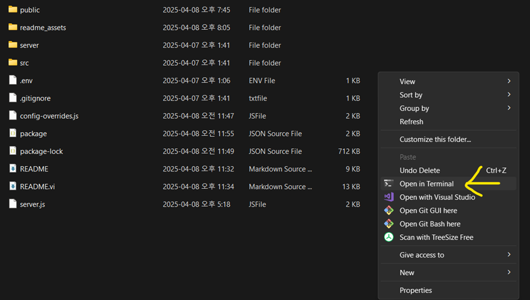

# Phần Mềm Tạo Phụ Đề Tự Động

Phần mềm web giúp tạo phụ đề có thời gian chính xác cho video bằng công nghệ AI Gemini của Google.

## Ảnh Minh Họa

<div align="center">
  <table>
    <tr>
      <td></td>
      <td></td>
      <td></td>
    </tr>
    <tr>
      <td align="center"><strong>Giao diện sáng/tối với hỗ trợ tiếng Việt, Anh, Hàn</strong></td>
      <td align="center"><strong>Tải lên video dài, âm thanh, hoặc từ YouTube</strong></td>
      <td align="center"><strong>Xử lý song song với lựa chọn mô hình khi thử lại</strong></td>
    </tr>
    <tr>
      <td></td>
      <td></td>
      <td></td>
    </tr>
    <tr>
      <td align="center"><strong>Giao diện chỉnh sửa với điều khiển thời gian và hiển thị trực quan</strong></td>
      <td align="center"><strong>Tùy chỉnh kiểu phụ đề và xuất video với phụ đề</strong></td>
      <td align="center"><strong>Cài đặt phụ đề với chế độ trong suốt và hỗ trợ toàn màn hình</strong></td>
    </tr>
    <tr>
      <td></td>
      <td></td>
      <td></td>
    </tr>
    <tr>
      <td align="center"><strong>Dịch phụ đề sang bất kỳ ngôn ngữ nào với thời gian giữ nguyên</strong></td>
      <td align="center"><strong>Thiết lập API, tích hợp OAuth, cập nhật ứng dụng và khôi phục cài đặt gốc</strong></td>
      <td align="center"><strong>Cấu hình thời lượng đoạn, lựa chọn mô hình và định dạng thời gian</strong></td>
    </tr>
    <tr>
      <td></td>
      <td></td>
      <td></td>
    </tr>
    <tr>
      <td align="center"><strong>Mẫu lời nhắc và tùy chọn tùy chỉnh</strong></td>
      <td align="center"><strong>Quản lý bộ nhớ đệm và thông tin lưu trữ</strong></td>
      <td></td>
    </tr>
  </table>
</div>

## Tính Năng Chính

- Tải lên video hoặc nhập đường link YouTube
- Tạo phụ đề chính xác bằng AI Gemini
- Chỉnh sửa thời gian phụ đề với giao diện trực quan
- Hiển thị trực quan dòng thời gian để điều chỉnh chính xác
- Tải xuống phụ đề dạng SRT hoặc JSON
- Xem trước phụ đề trên video theo thời gian thực
- Hỗ trợ nhiều ngôn ngữ (Tiếng Việt, Anh, Hàn)
- Điều chỉnh thời gian dính (Sticky) cho các thay đổi hàng loạt
- Chức năng Hoàn tác/Đặt lại cho việc chỉnh sửa
- Xử lý song song cho video dài
- Gộp các dòng phụ đề liền kề chỉ với một cú nhấp chuột
- Tùy chỉnh định dạng hiển thị thời gian (giây hoặc HH:MM:SS)
- Hiệu suất tối ưu cho video dài với nhiều phụ đề
- Chỉ báo tiến trình mượt mà và liên tục cho phụ đề hiện tại
- Chế độ tối mặc định với hỗ trợ chế độ sáng và tùy chọn theo hệ thống

## Hướng Dẫn Cài Đặt Chi Tiết

### Cài Đặt Trên Windows

#### 1. Cài Đặt Node.js

Node.js là môi trường chạy JavaScript cần thiết cho ứng dụng này.

**Cách 1: Cài đặt nhanh bằng winget (Khuyến nghị)**

Mở PowerShell hoặc Command Prompt với quyền Administrator và chạy lệnh sau:
```powershell
winget install --id OpenJS.NodeJS -e --source winget --accept-package-agreements --accept-source-agreements
```

QUAN TRỌNG: Đóng cửa sổ PowerShell hiện tại.
Mở một cửa sổ PowerShell hoặc Command Prompt MỚI và kiểm tra cài đặt:
```powershell
node -v
npm -v
```
Nếu hiển thị phiên bản, bạn đã cài đặt thành công.

**Cách 2: Cài đặt thủ công**

**Bước 1:** Truy cập trang web chính thức của Node.js tại [https://nodejs.org/](https://nodejs.org/)

**Bước 2:** Tải phiên bản LTS (Long Term Support) - đây là phiên bản ổn định nhất

**Bước 3:** Chạy file cài đặt vừa tải về:
- Nhấn "Next" qua các bước cài đặt
- Chọn thư mục cài đặt (hoặc để mặc định)
- Đánh dấu tất cả các tùy chọn và nhấn "Next"
- Nhấn "Install" để bắt đầu cài đặt
- Nhấn "Finish" khi hoàn tất

**Bước 4:** Kiểm tra cài đặt:
- Mở Command Prompt (nhấn phím Windows, gõ "cmd" và nhấn Enter)
- Gõ lệnh sau và nhấn Enter:
```
node --version
```
- Nếu hiển thị phiên bản (ví dụ: v18.16.0), bạn đã cài đặt thành công

#### 2. Cài Đặt FFmpeg

FFmpeg là công cụ xử lý video cần thiết cho ứng dụng.

**Cách 1: Cài đặt nhanh bằng winget (Khuyến nghị)**

Mở PowerShell hoặc Command Prompt với quyền Administrator và chạy lệnh sau:
```powershell
winget install --id Gyan.FFmpeg -e --source winget --accept-package-agreements --accept-source-agreements
```

Kiểm tra cài đặt: Mở một cửa sổ PowerShell hoặc Command Prompt MỚI và chạy:
```powershell
ffmpeg -version
```
Nếu hiển thị thông tin phiên bản, bạn đã cài đặt thành công.

**Cách 2: Cài đặt thủ công**

**Bước 1:** Tải FFmpeg từ trang chính thức:
- Truy cập [https://ffmpeg.org/download.html](https://ffmpeg.org/download.html)
- Chọn phiên bản Windows
- Tải gói "Windows builds from gyan.dev" (phiên bản full)

**Bước 2:** Giải nén file vừa tải về:
- Nhấp chuột phải vào file .zip và chọn "Extract All..."
- Chọn thư mục đích (ví dụ: C:\FFmpeg)
- Nhấn "Extract"

**Bước 3:** Thêm FFmpeg vào biến môi trường Path:
- Nhấn phím Windows, gõ "environment variables" và chọn "Edit the system environment variables"
- Nhấn nút "Environment Variables..."
- Trong phần "System variables", tìm biến "Path" và nhấn "Edit..."
- Nhấn "New" và thêm đường dẫn đến thư mục bin của FFmpeg (ví dụ: C:\FFmpeg\bin)
- Nhấn "OK" để lưu các thay đổi

**Bước 4:** Kiểm tra cài đặt:
- Mở Command Prompt mới
- Gõ lệnh sau và nhấn Enter:
```
ffmpeg -version
```
- Nếu hiển thị thông tin phiên bản, bạn đã cài đặt thành công

### Cài Đặt Trên macOS

#### 1. Cài Đặt Node.js và FFmpeg bằng Homebrew (Khuyến nghị)

Homebrew là trình quản lý gói cho macOS giúp việc cài đặt phần mềm trở nên dễ dàng.

**Bước 1:** Cài đặt Homebrew (nếu chưa có):
```bash
/bin/bash -c "$(curl -fsSL https://raw.githubusercontent.com/Homebrew/install/HEAD/install.sh)"
```

**Bước 2:** Cài đặt Node.js:
```bash
brew install node
```

Kiểm tra cài đặt:
```bash
node -v
npm -v
```

**Bước 3:** Cài đặt FFmpeg:
```bash
brew install ffmpeg
```

Kiểm tra cài đặt:
```bash
ffmpeg -version
```

#### 2. Cài Đặt Thủ Công

**Cài đặt Node.js:**

**Bước 1:** Tải bộ cài đặt cho macOS từ [trang web Node.js](https://nodejs.org/)

**Bước 2:** Chọn phiên bản LTS (Long Term Support) - đây là phiên bản ổn định nhất

**Bước 3:** Chạy bộ cài đặt và làm theo hướng dẫn

**Bước 4:** Kiểm tra cài đặt bằng cách mở Terminal và chạy:
```bash
node -v
npm -v
```

**Cài đặt FFmpeg:**

**Bước 1:** Tải FFmpeg từ [trang web FFmpeg](https://ffmpeg.org/download.html)

**Bước 2:** Giải nén file đã tải về

**Bước 3:** Di chuyển FFmpeg vào thư mục trong PATH, ví dụ:
```bash
sudo mv ffmpeg /usr/local/bin/
```

**Bước 4:** Kiểm tra cài đặt:
```bash
ffmpeg -version
```

### 3. Cài Đặt Ứng Dụng

**Bước 1:** Tải mã nguồn:
- Tải file ZIP từ GitHub hoặc sử dụng lệnh git clone (nếu bạn đã cài Git)
- Giải nén file ZIP vào thư mục bạn muốn (ví dụ: C:\subtitles-generator trên Windows hoặc ~/subtitles-generator trên macOS)

**Bước 2:** Cài đặt các gói phụ thuộc:

**Trên Windows:**
- Mở thư mục ứng dụng - Chuột phải vào khoảng trống (như hình) - chọn Open in Terminal



**Trên macOS:**
- Mở Terminal
- Di chuyển đến thư mục ứng dụng bằng lệnh `cd`, ví dụ:
```bash
cd ~/subtitles-generator
```

**Cài đặt các gói phụ thuộc (cả Windows và macOS):**
```bash
npm install
```
- Quá trình này có thể mất vài phút tùy thuộc vào tốc độ mạng


## Cách Sử Dụng Ứng Dụng

### 1. Khởi Động Ứng Dụng

**Trên Windows:**
- Mở thư mục ứng dụng - Chuột phải vào khoảng trống (như hình) - chọn Open in Terminal


**Trên macOS:**
- Mở Terminal
- Di chuyển đến thư mục ứng dụng bằng lệnh `cd`, ví dụ:
```bash
cd ~/subtitles-generator
```

**Chạy ứng dụng (cả Windows và macOS):**
```bash
npm run dev
```
- Ứng dụng sẽ tự động mở trong trình duyệt web của bạn

### 2. Cấu Hình Ứng Dụng

Điều chỉnh cài đặt thông qua biểu tượng bánh răng ở góc trên bên phải:
- Thay đổi ngôn ngữ giao diện (Tiếng Việt là mặc định, cũng hỗ trợ Tiếng Anh và Hàn)
- Quản lý cài đặt API (Gemini và YouTube)
- Chọn mô hình Gemini (Gemini 2.5 Pro là mặc định để có độ chính xác cao nhất)
- Cấu hình thời lượng đoạn cho video dài (20 phút là mặc định)
- Chọn định dạng hiển thị thời gian (HH:MM:SS là mặc định, hoặc giây)
- Xóa bộ nhớ đệm và quản lý lưu trữ

### 3. Tạo Phụ Đề

**Cách 1: Từ Video YouTube**
- Chọn tab "YouTube URL"
- Dán đường link YouTube vào ô
- Nhấn "Tải Video"
- Sau khi tải xong, nhấn "Tạo phụ đề"

**Cách 2: Từ File Video**
- Chọn tab "Tải File Lên"
- Nhấn "Chọn File" và chọn video từ máy tính
- Sau khi tải lên, nhấn "Tạo phụ đề"

### 4. Chỉnh Sửa Phụ Đề

- Kéo các điểm đầu/cuối trên dòng thời gian để điều chỉnh thời gian
- Nhấn vào biểu tượng bút chì bên cạnh phụ đề để sửa nội dung
- Sử dụng nút "+" để thêm phụ đề mới
- Sử dụng nút "X" để xóa phụ đề
- Sử dụng nút gộp để kết hợp hai phụ đề liền kề

### 5. Tải Xuống Phụ Đề

- Nhấn nút "Tải SRT" để tải phụ đề dạng SRT (định dạng phổ biến nhất)
- Hoặc nhấn "Tải JSON" để tải dạng dữ liệu JSON

## Xử Lý Sự Cố Thường Gặp

### Không Thể Cài Đặt Node.js

**Trên Windows:**
- Đảm bảo bạn có quyền quản trị viên trên máy tính
- Tắt tạm thời phần mềm diệt virus
- Thử tải lại file cài đặt từ trang chính thức

**Trên macOS:**
- Đảm bảo bạn có quyền quản trị (sudo)
- Nếu sử dụng Homebrew, hãy chạy `brew doctor` để kiểm tra vấn đề
- Thử cài đặt lại Homebrew bằng cách chạy lệnh cài đặt Homebrew

### Không Thể Cài Đặt FFmpeg

**Trên Windows:**
- Nếu cài đặt thủ công gặp khó khăn, hãy sử dụng tính năng cài đặt tự động của ứng dụng
- Kiểm tra xem bạn đã thêm đúng đường dẫn vào biến môi trường Path chưa

**Trên macOS:**
- Nếu sử dụng Homebrew, hãy thử chạy `brew update` và sau đó `brew install ffmpeg` lại
- Kiểm tra xem có lỗi nào trong Terminal khi cài đặt không
- Thử cài đặt phiên bản cụ thể: `brew install ffmpeg@4.4`

### Ứng Dụng Không Khởi Động

**Vấn đề chung (cả Windows và macOS):**
- Kiểm tra xem bạn đã cài đặt Node.js chưa
- Đảm bảo bạn đã chạy lệnh `npm install` để cài đặt các gói phụ thuộc
- Kiểm tra lỗi trong Terminal/Command Prompt khi chạy `npm run dev`

**Trên macOS:**
- Kiểm tra quyền truy cập thư mục: `chmod -R 755 ./node_modules`
- Thử xóa thư mục node_modules và cài đặt lại: `rm -rf node_modules && npm install`

### Không Thể Tạo Phụ Đề
- Kiểm tra xem bạn đã nhập đúng API key Gemini chưa
- Đảm bảo video đã được tải lên hoặc tải xuống thành công
- Thử chọn mô hình Gemini khác trong cài đặt

### Video YouTube Không Tải Được
- Kiểm tra kết nối internet
- Đảm bảo video không bị giới hạn độ tuổi hoặc riêng tư
- Thử lại sau vài phút

## Tính Năng Nâng Cao

### Cập Nhật Ứng Dụng

Ứng dụng có tính năng cập nhật tự động thông qua Git:
- Vào phần Cài đặt (biểu tượng bánh răng)
- Ở cuối trang cài đặt, nhấn nút "Cập nhật"
- Ứng dụng sẽ tự động kéo các thay đổi mới nhất từ kho lưu trữ
- Làm mới trang để áp dụng các thay đổi

### Khôi Phục Cài Đặt Gốc

Nếu bạn muốn xóa tất cả dữ liệu và cài đặt:
- Vào phần Cài đặt (biểu tượng bánh răng)
- Ở cuối trang cài đặt, nhấn nút "Khôi phục cài đặt gốc"
- Xác nhận hành động khi được nhắc
- Ứng dụng sẽ xóa tất cả bộ nhớ đệm và dữ liệu trình duyệt, sau đó tự động tải lại

## Thông Tin Thêm

- Ứng dụng này sử dụng AI Gemini của Google để tạo phụ đề
- Phụ đề được tạo có thể cần chỉnh sửa để đạt độ chính xác cao nhất
- Đối với video dài (trên 15 phút), ứng dụng sẽ tự động chia thành các đoạn nhỏ để xử lý
- Mặc định, giao diện ứng dụng là tiếng Việt, bạn có thể chuyển sang tiếng Anh hoặc tiếng Hàn trong cài đặt

## Hỗ Trợ và Liên Hệ

Nếu bạn gặp vấn đề hoặc có câu hỏi, vui lòng tạo issue trên GitHub hoặc liên hệ qua email hỗ trợ.

---

Phần mềm này được phát hành dưới giấy phép MIT.
